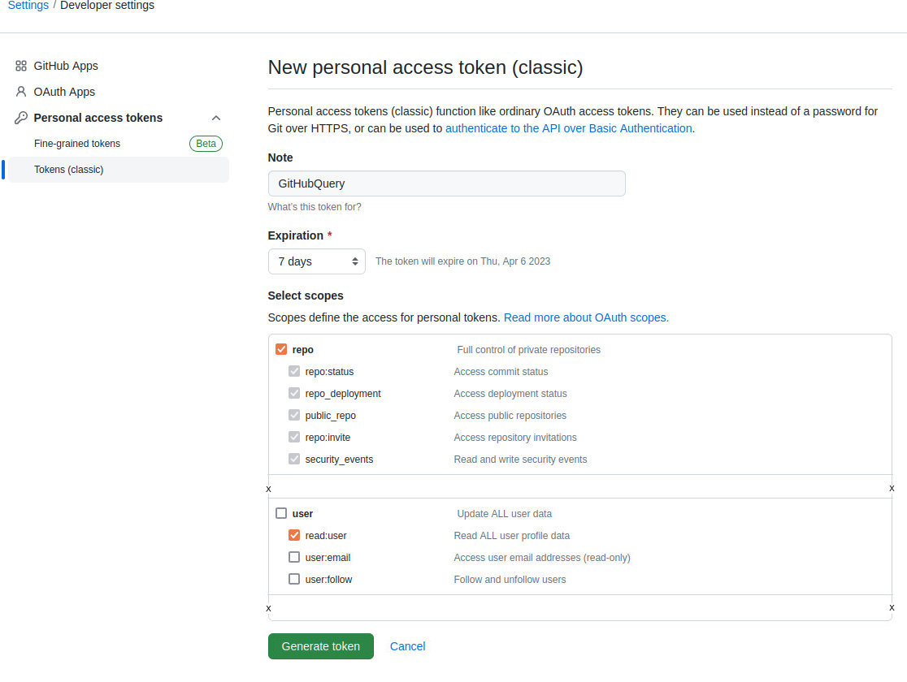

# github-repo-info

This is a set of Python scripts for getting some repository metadata from the GitHub API and then doing stuff with it (that *stuff* is described below). The [GitHub REST API](https://docs.github.com/en/rest/guides/getting-started-with-the-rest-api) is very powerful and this simple use-case barely scratches the surface.

[get_gh_data.py](#get_gh_datapy) requests data from the GitHub API and saves a set of *data* CSV files listing *repositories*, *licenses*, and *topics*. Accessing the GitHub API is done with this separate script, so it is not necessary to keep hitting the API while working on the other scripts.

[qry_gh_data.py](#qry_gh_datapy) reads the *data* CSV files and writes another set of CSV files that serve as reports (easily loaded into LibreOffice Calc or Excel).

[topics_md.py](#topics_mdpy) reads the *data* CSV files and writes Markdown files that use [collapsed-sections](https://docs.github.com/en/get-started/writing-on-github/working-with-advanced-formatting/organizing-information-with-collapsed-sections) to show *Repositories by License* and *Repositories by Topic*. It can also insert those sections into another Markdown document, such as a README.md file.

---

### get_gh_data.py

This script uses the [PyGithub](https://pypi.org/project/PyGithub/) module to access the GitHub API.

A [personal access token](https://docs.github.com/en/authentication/keeping-your-account-and-data-secure/creating-a-personal-access-token) is required to use the GitHub API. You can provide the path to a file containing the token using the `--key-file` parameter. The file must be formatted as follows:

`key="YOUR_TOKEN_HERE"`

If you do not provide a `--key-file` argument, the script looks for the file `~/KeepLocal/get_gh_data-settings.txt` (where `~/` expands to the user's *home* directory).

The screenshot below shows the scopes I selected. It may be possible to use a more restrictive *repo* scope if only *public* repository data is requested[^1]. I wanted to include *private* repos as well in the data being retrieved.




**Command-Line Usage**

```
usage: get_gh_data.py [-h] [-k KEYFILE]

Queries the GitHub API for metadata about a user's repositories and saves it
into CSV files.

optional arguments:
  -h, --help            show this help message and exit
  -k KEYFILE, --key-file KEYFILE
                        Name of the file containing the GitHub Personal Access
                        Token needed to query the API.
```


### qry_gh_data.py

This script reads the *data* CSV files and writes the following CSV files to an `output` sub-directory:
- `repos-langs.csv`
- `repos-private.csv`
- `repos-public.csv`
- `repos-public-md.csv`
- `repos-topics.csv`


### topics_md.py

This script reads the *data* CSV files and writes the following Markdown files to an `output` sub-directory:
- `repos-by-license.md`
- `repos-by-topic.md`

**Writing into another Markdown file**

The *Repositories by License* and *Repositories by Topic* Markdown text can also be insert into another Markdown document, such as a *README.md* file.

If you use the `--insert-into` parameter, the script looks for specific HTML **comment tags**, in the target file, that serve as *begin* and *end* markers for inserting the sections as shown below. The tags must be exactly as shown, including the underscores, and be on separate lines with no other text. If the tags are not found, then the document is not changed. Also, it is not necessary to use both sections.

...
`<!-- Begin_Repositories_by_Topic -->`
<small>(*Repositories by Topic* section inserted/replaced here)</small>
`<!-- End_Repositories_by_Topic -->`
...
`<!-- Begin_Repositories_by_License -->`
<small>(*Repositories by License* section inserted/replaced here)</small>
`<!-- End_Repositories_by_License -->`
...

**Command-Line Usage**

```
usage: topics_md.py [-h] [--insert-into INTO_FILE] [-o OUTDIR]

Reads GitHub repository metadata from CSV files saved by get_gh_data.py and
writes Markdown files listing 'Repositories by Topics' and 'Repositories by
License'. Can also insert those as sections into another Markdown document
(such as a README.md).

optional arguments:
  -h, --help            show this help message and exit
  --insert-into INTO_FILE
                        Optional. File in which to insert the Markdown
                        sections.
  -o OUTDIR, --output-to OUTDIR
                        Directory in which to create output files. Optional.
                        By default the output is written to a directory named
                        'output' under the currrent working directory.
```

### Notes

If you are using *Visual Studio Code*, the [Rainbow CSV](https://marketplace.visualstudio.com/items?itemName=mechatroner.rainbow-csv) extension is very helpful for seeing the individual data fields when viewing CSV files in the editor. It's much quicker than opening the file in *Calc* or *Excel* when trying to spot the fields in plain text starts making your eyes cross.

[^1]: TODO: Explore *access scopes* in more detail.